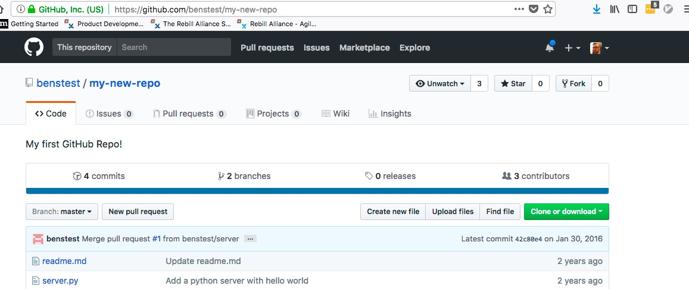
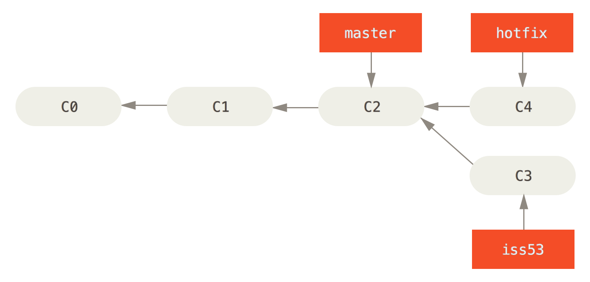
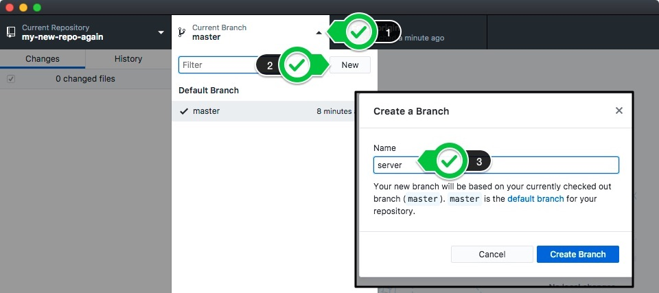

## INTRODUCTION TO GIT AND GITHUB
#### http://getjobber.com
#### @benzittlau
#### http://benzittlau.com
#### http://springlaunched.com
#### http://zittlau.ca
#### http://github.com/benzittlau


## What we're going to cover
What is Git?

Why would I use it?

Installing Git

First steps in Git

Setting up a GitHub account

Creating a GitHub Repository

Using Git Branches and GitHub


## WHAT IS GIT?
[Version/Source Control Management](https://en.wikipedia.org/wiki/Version_control)

Keeps a versioned history of all changes (additions, removals, modifications) of all files in a project


## WHY WOULD WE USE GIT?
If you've ever named a file `index-version2.html` or `index-original.html` you've needed Git

Facilitates temporary "forks" or experiments without losing your "good" version

Powerful collaboration tool allowing multiple developers to work in the same area of code


## INSTALLING GIT
Git can be used through the command-line or through a GUI tool

I *strongly* recommend learning the command-line tool, but for today we'll start with the GUI interface

[GitHub GUI For OS X](https://mac.github.com/)

[GitHub GUI For Windows](https://windows.github.com/)


## INSTALLING GIT ON Linux
GitHub doesn't have a GUI client for Linux, so we'll use the command-line tool

```sh
$ sudo apt-get update
$ sudo apt-get install git
```


## CONFIGURING GIT(GUI)
Skip Setup when Prompted

Go to GitHub Desktop => Preferences => Advanced

Enter your name and e-mail


## CONFIGURING GIT(CLI)
``` sh
$ git config --global user.name "YOUR NAME"
$ git config --global user.email "YOUR EMAIL ADDRESS"
```


## First steps in Git
Create a new "Repo"

Write a basic readme file

Commit the readme to the project


## Creating a new "Repo"
A repository (or Repo) is a project in Git that lives in one directory (and as many sub-directories as you want).


### In CLI
```sh
$ mkdir -p ~/GitHub/my-new-repo
$ cd ~/GitHub/my-new-repo
$ git init
```


## Create a Readme file
Using your editor of choice create a file at `~/GitHub/my-new-repo/readme.md`

`.md` extension is for [MarkDown](https://daringfireball.net/projects/markdown/), a common markup language

Add the following:

```markdown
# My First Git Repo
Welcome to my first git repository!  This is it's first file!
```

Save your `readme.md` file


## Commit your Readme file
Commiting changes is like setting a bookmark.  You can always return to any state you've committed, but if you make changes without commits you will lose them!

Commit early and commit often!


## Commit your Readme file (CLI)
```sh
$ git add .
$ git commit -am "Add a readme file to the project"
```


## What makes a good commit message?
A lot can be said about [writing good commit messages](http://chris.beams.io/posts/git-commit/), but as a rule of thumb they should be `descriptive`, and `concise`.

### Good Messages
"Add twitter bootstrap library to Gemfile"

"Fix double submission bug on signup form"

"Resolve deprecration warnings from Rails upgrade"

### Bad Messages
"Commit"

"Fix bug"

"asdf"


## View our commit
We can now see our committed change


### Git CLI
```sh
$ git --no-pager log
commit da535744e1e988a777d992bccc8ad53638504eac
Author: Ben Zittlau <ben@zittlau.ca>
Date:   Sat Jan 23 21:47:33 2016 -0700

    Add a readme file to the project
```


## Setup Github
What is GitHub?

Create a GitHub Account

Configure Git client for your GitHub Account


## What is GitHub?
[GitHub](https://github.com) is primarily a tool for managing Git repositories, but also has powerful tools for collaboration, communication, and community

Most open source projects are hosted on GitHub, including those by the [BBC](https://github.com/bbc), [Microsoft](https://github.com/microsoft), [Apple](https://github.com/apple), and many others

GitHub will allow you to share repositories with your team members, and facilitate the process of working together


## Create a GitHub Account
Go to [GitHub's SignUp Form](https://github.com/join)

Fill in a username, e-mail, and password (pick your username carefully!)

Choose the free plan when asked to choose a plan


## Configure Git Client
Go to GitHub Desktop => Preferences => Accounts

Enter your Login and Password from the account you created


## Configure Git Client (Linux CLI)
You'll be prompted for your username/password when you interact with GitHub, but you'll want to enable caching so you aren't prompted for each operation

``` sh
$ git config --global credential.helper cache
$ git config --global credential.helper 'cache --timeout=3600'
```

A better long term solution that requires more setup is to enable [SSH Keys](https://help.github.com/articles/generating-a-new-ssh-key/)


## Creating a GitHub Repository
Publishing your local repo using the GitHub Tool
Create a new GitHub Repo directly through GitHub (CLI)
Visit your Repo online
Invite a collaborator to your repository


## Publish your local repo using the GitHub Tool
Click the "Public" button in the top right-hand corner of the tool

Fill out a description for your repo

Click "Publish Repository"


## New GitHub Repo (CLI)
Go to your [GitHub dashboard](https://github.com)

Click on "+ New Repository" (You may need to validate your e-mail)

Fill in a "my-new-repo" for name, and a description.


Link your local repo to the remote repository, and push up your commit

```sh
$ git remote add origin https://github.com/<your username>/my-new-repo.git
$ git push -u origin master
```


## Visit your Repo Online
You can now see your repo online, shared with the world

Go to https://github.com/[your username]/my-new-repo



As this is a public repo this is available to everyone in the world

If you upgrade your GitHub plan to a paid subscription you can add Private repos which are not shared publically


## Invite a collaborator to your repository
Turn to the person beside you and ask them for their GitHub username

From your Repo page to go Settings => Collaborators.  Enter their GitHub username in the search box, and click "Add Collaborator"


This GitHub user now has access to modify code in your repository.  Make sure you only add people you trust as collaborators to your repositories.


## Using Git Branches and GitHub Pull Requests
Where the real power of Git Shines


## What are Git branches?
A "branch" allows you to fork away from "master" and manage work in progress, try fixing a bug, write a new feature, etc. without polluting a "good" state of your project in master




## Creating a branch
We're going to add a basic python web server to our project, so let's create a branch called "server".  Your branch names should be descriptive of their purpose.

Click on the "New Branch" button shaped like a two-pronged fork.

Populate the name field with "server"

Click "Create Branch"



### Using the CLI
```sh
$ git checkout -b server
```


## Add a new file to our branch
Using a text editor create a new file `server.py` and add the following:

```python
import cherrypy
	  
class HelloWorld(object):
    def index(self):
        return "Hello World!"
    index.exposed = True

cherrypy.quickstart(HelloWorld())
```


## Commit the file as before
Note that we are now committing to our `server` branch, not master


```sh
$ git add .
$ git commit -am "Add a readme file to the project"
```


## "Push" our branch to GitHub
We're now going to "push" so our branch is available on GitHub

Click the "Publish" button (the screenshot shows sync, yours will show publish)


### Using CLI

```sh
$ git push origin server
```


## Create a new Pull Request
Go to your repo on github:

`https://github.com/[your username]/my-new-repo`

Click on "New pull request"


## Create a new Pull Request
Select the `server` branch

Click "Create pull request"


## Merge Pull Request into Master
Once your team members have looked at your code and you are ready, you can now "merge" it into `master` so it can become part of the main stream of the project.


# Exercise
## Create a Ping Pong "Game"
###Bonus Points: Use only the command line


## Step 1 - Pick a Partner
Pick someone to work with, whoever's handy.

Choose one of you to be "Ping", the other is "Pong"


## Step 2 - Create your GitHub Repo
Setup a GitHub Repo for a new project called "ping_pong"

Initialize it with a simple `readme.md` file

Checkout that Repo on both partners computers


## Step 3 - Create your python game file
Add a python file `ping_pong_game.py`  with the below to your master branch:

```python
#!/usr/bin/python
import time

######################
# Write Ping After Here
######################

######################
# Write Pong After Here
######################

Ping.bounce()
```


## Step 4 - Create your own branches
Get the updated version of master on both computers and create your branches:

If you're ping, create a branch "add_ping"

If you're pong, create a branch "add_pong"


## Step 5 - Adding the appropriate Code
On your branches, add your part of the code to the file

If you're ping, add this after the "ping" comment section

```python
class Ping:
    @staticmethod
    def bounce():
        print "Ping"
        time.sleep(1)
        Pong.bounce()
```
If you're pong, create a branch "add_pong"
```
class Pong:
    @staticmethod
    def bounce():
        print "Pong"
        time.sleep(1)
        Ping.bounce()
```


## Step 6 - Create Pull Requests for your branches
Create a PR for your branch

Have your partner merge your pull request into your `master` branch


## Step 7 - Get the updated master branch and run it
Update your master branch from GitHub

Run your game:

```bash
python ping_pong_game.py
```


## Step 8 - Profit


# Resources
* [This presentations GitHub project](https://github.com/benzittlau/ece-hackathon-intro-to-git)
* [Set up Git (GitHub)](https://help.github.com/articles/set-up-git/)
* [How to write a Git commit message](http://chris.beams.io/posts/git-commit/)
* [Git From The Inside Out](https://codewords.recurse.com/issues/two/git-from-the-inside-out)

