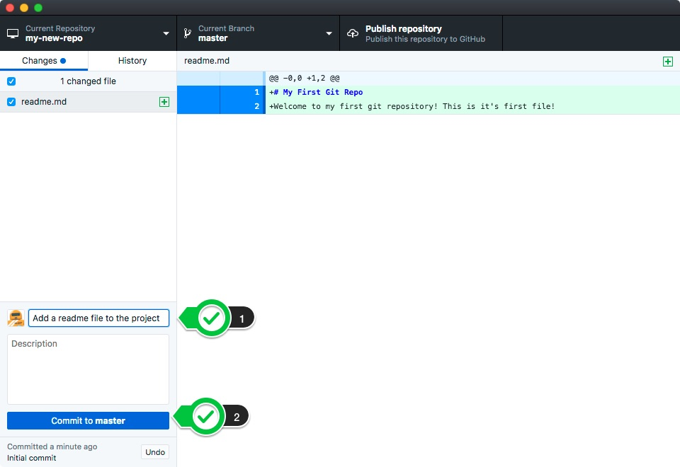

## INTRODUCTION TO GIT AND GITHUB
#### http://getjobber.com
#### @benzittlau
#### http://benzittlau.com
#### http://springlaunched.com
#### http://zittlau.ca
#### http://github.com/benzittlau


## What we're going to cover
What is Git?

Why would I use it?

Installing Git

First steps in Git

Setting up a GitHub account

Creating a GitHub project

Using Git Branches and GitHub


## WHAT IS GIT?
[Version/Source Control Management](https://en.wikipedia.org/wiki/Version_control)

Keeps a versioned history of all changes (additions, removals, modifications) of all files in a project


## WHY WOULD WE USE GIT?
If you've ever named a file `index-version2.html` or `index-original.html` you've needed Git

Facilitates temporary "forks" or experiments without losing your "good" version

Powerful collaboration tool allowing multiple developers to work in the same area of code


## INSTALLING GIT
Git can be used through the command-line or through a GUI tool

I *strongly* recommend learning the command-line tool, but for today we'll start with the GUI interface

[GitHub GUI For OS X](https://mac.github.com/)

[GitHub GUI For Windows](https://mac.github.com/)


## INSTALLING GIT ON Linux
GitHub doesn't have a GUI client for Linux, so we'll use the command-line tool

```sh
$ sudo apt-get update
$ sudo apt-get install git
```


## CONFIGURING GIT(GUI)
Skip Setup when Prompted

Go to GitHub Desktop => Preferences => Advanced

Enter your name and e-mail


## CONFIGURING GIT(CLI)
``` sh
$ git config --global user.name "YOUR NAME"
$ git config --global user.email "YOUR EMAIL ADDRESS"
```


## First steps in Git
Create a new "Repo"

Write a basic readme file

Commit the readme to the project


## Creating a new "Repo"
A repository (or Repo) is a project in Git that lives in one directory (and as many sub-directories as you want).


### In CLI
```sh
$ mkdir -p ~/GitHub/my-new-repo
$ cd ~/GitHub/my-new-repo
$ git init
```


## Create a Readme file
Using your editor of choice create a file at `~/GitHub/my-new-repo/readme.md`

`.md` extension is for [MarkDown](https://daringfireball.net/projects/markdown/), a common markup language

Add the following:

```markdown
# My First Git Repo
Welcome to my first git repository!  This is it's first file!
```

Save your `readme.md` file


## Commit your Readme file
Commiting changes is like setting a bookmark.  You can always return to any state you've committed, but if you make changes without commits you will lose them!

Commit early and commit often!




## Commit your Readme file (CLI)
```sh
$ git add .
$ git commit -am "Add a readme file to the project"
```


## What makes a good commit message?
A lot can be said about [writing good commit messages](http://chris.beams.io/posts/git-commit/), but as a rule of thumb they should be `descriptive`, and `concise`.

### Good Messages
"Add twitter bootstrap library to Gemfile"

"Fix double submission bug on signup form"

"Resolve deprecration warnings from Rails upgrade"

### Bad Messages
"Commit"

"Fix bug"

"asdf"


## View our commit
We can now see our committed change


### Git CLI
```sh
$ git --no-pager log
commit da535744e1e988a777d992bccc8ad53638504eac
Author: Ben Zittlau <ben@zittlau.ca>
Date:   Sat Jan 23 21:47:33 2016 -0700

    Add a readme file to the project
```


## Setup Github
What is GitHub?
Create a GitHub Account
Configure Git client for your GitHub Account


## What is GitHub?
[GitHub](https://github.com) is primarily a tool for managing Git repositories, but also has powerful tools for collaboration, communication, and communication.
Most open source projects are hosted on GitHub, including those by the [BBC](https://github.com/bbc), [Microsoft](https://github.com/microsoft), [Apple](https://github.com/apple), and many others.
GitHub will allow you to share repositories with your team members, and facilitate the process of working together


## Create a GitHub Account
Go to [GitHub's SignUp Form](https://github.com/join)
Fill in a username, e-mail, and password (pick your username carefully!)
Choose the free plan when asked to choose a plan


## Configure Git client
Go to GitHub Desktop => Preferences => Accounts

Enter your Login and Password from the account you created


# Resources
* [This presentations GitHub project](https://github.com/benzittlau/ece-hackathon-intro-to-git)
* [Set up Git (GitHub)](https://help.github.com/articles/set-up-git/)
* [How to write a Git commit message](http://chris.beams.io/posts/git-commit/)
* [Git From The Inside Out](https://codewords.recurse.com/issues/two/git-from-the-inside-out)

